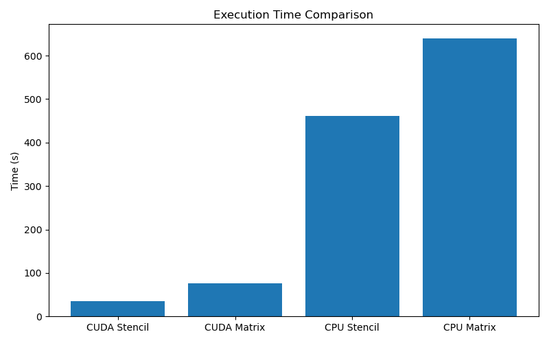
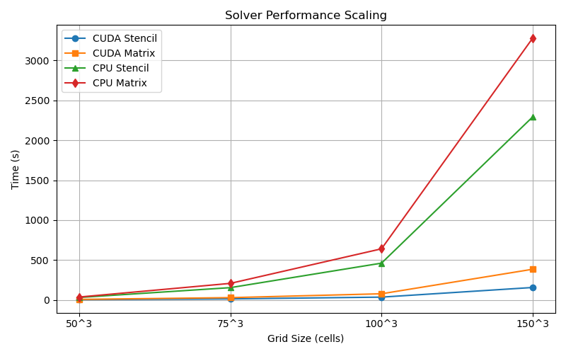

# Summary

`HeatTransfer3D` is a lightweight, high-performance C++ solver for 3D heat conduction problems on structured Cartesian grids. It imports 3D geometries from STL files and incorporates them into the computational domain using voxelization. Geometry is mapped onto grid cells and used to define internal, external, and boundary regions. The solver supports mixed Dirichlet and Neumann boundary conditions on these regions.

The software provides **four interchangeable solver backends** — CPU and CUDA implementations of stencil-based and matrix-based Jacobi iterative solvers — allowing users to balance computational speed, memory usage, and hardware availability. Results are exported in VTK format for visualization in ParaView.

The software targets researchers and engineers working in thermal management, materials processing, electronics cooling, and related heat conduction applications.

# Summary

**HeatTransfer3D** is a lightweight, high-performance C++17 solver for steady-state and transient 3D heat conduction on structured Cartesian grids. The software supports direct import of complex geometries from STL files through a custom ray-tracing voxelization method and handles mixed Dirichlet and Neumann boundary conditions.

A key feature is its **four interchangeable solver backends**: stencil-based and matrix-based Jacobi solvers, each available on both CPU (with OpenMP) and CUDA (GPU). This multi-backend design allows users to trade off between memory usage, convergence speed, and hardware availability. Simulation results are exported in VTK format for easy visualization in ParaView.

HeatTransfer3D targets engineers and researchers in thermal management, electronics cooling, battery systems, and additive manufacturing who need fast, reproducible heat conduction simulations with minimal setup overhead.

# Statement of Need

Modeling three-dimensional heat conduction in complex geometries is essential in many engineering applications, including electronics cooling, battery thermal management, additive manufacturing, and heat exchanger design. However, researchers and engineers often face a difficult trade-off: commercial tools such as ANSYS and COMSOL are powerful but expensive and heavyweight, while open-source alternatives usually require complex mesh generation or lack straightforward support for real-world geometries.

General-purpose frameworks such as OpenFOAM [@weller2007openfoam; @jasak2007openfoam] and FEniCS [@logg2012automated] provide high flexibility but involve substantial setup overhead (mesh generation, solver configuration, case setup) even for pure heat conduction problems. Conversely, many lightweight finite-difference solvers are efficient on Cartesian grids but typically assume geometry is already discretized and offer limited geometry import capabilities or backend flexibility.

`HeatTransfer3D` addresses this gap by providing a lightweight, focused open-source solver for steady-state and transient 3D heat conduction. It combines direct **STL geometry import via voxelization** (using ray tracing) with structured Cartesian grids, support for mixed Dirichlet/Neumann boundary conditions, and four interchangeable high-performance solver backends (CPU + CUDA, stencil-based and matrix-based Jacobi). The software features a simple command-line interface and VTK output for easy visualization in ParaView, making it ideal for rapid prototyping, parametric studies, and engineering workflows where minimal setup and high reproducibility are critical.

# State of the Field

Existing open-source tools for heat conduction can be broadly grouped into general-purpose multiphysics frameworks, structured-grid solvers, and specialized/GPU-focused implementations.

Heavyweight frameworks such as OpenFOAM [@weller2007openfoam; @jasak2007openfoam], FEniCS [@logg2012automated], and OpenSBLI [@howell2016opensbli] offer great flexibility for coupled physics but come with significant overhead in meshing and configuration, which is often excessive for pure heat conduction. Lightweight finite-difference codes on Cartesian grids are computationally efficient [@leveque2007finite; @patankar1980numerical] but generally lack integrated support for importing complex STL geometries and flexible boundary condition handling.

Several GPU-accelerated finite-difference solvers have been developed, primarily targeting performance on structured grids. However, most either require pre-discretized geometry, are limited to 2D domains, or are tied to specific research applications without providing modular, interchangeable solver backends.

Meshless methods such as RBF-FD [@fornberg2015solving] offer geometric flexibility but increase implementation complexity and are rarely GPU-accelerated. Educational tools tend to prioritize simplicity for teaching rather than performance or engineering usability.

`HeatTransfer3D` occupies a distinct middle ground by integrating:

- Direct STL voxelization with ray-tracing for geometry handling,
- Efficient finite-difference discretization on Cartesian grids,
- A multi-backend architecture (CPU/CUDA + stencil/matrix solvers),
- Lightweight design focused exclusively on heat conduction.

This combination is relatively uncommon and makes the software particularly suitable for engineers and researchers needing both geometric flexibility and high performance without the overhead of general-purpose frameworks.

# Software Design

`HeatTransfer3D` is written in modern **C++17** with optional **CUDA** support for GPU acceleration. The codebase follows a modular, extensible design that clearly separates CPU and GPU implementations while maintaining a unified high-level interface.

## Project Structure

The main components are organized as follows:

- **`src/`**: Contains the core implementation
  - `main.cpp` — Command-line argument parsing and simulation workflow
  - `grid.cpp`, `voxelReader.cpp` — Grid management and STL voxelization
  - `boundaryConditions.cpp` — Boundary condition handling
  - `solverCPU.cpp`, `linearAlgebraCPU.cpp` — CPU solver implementations
  - **`cudaSrc/`** — All CUDA-specific code:
    - `solverCUDAStencil.cu`, `solverCUDAMatrix.cu`
    - `kernel.cu`, `linearAlgebraGPU.cu`, `boundaryConditions.cu`

- **`include/`**: Public headers and interfaces
  - Core abstractions: `solver.hpp`, `solverFactory.hpp`, `grid.hpp`, `voxelReader.hpp`
  - CPU-specific: `solverCPU.hpp`
  - CUDA-specific: `cudaHeaders/` directory containing `.cuh` files
  - Supporting classes: `sparseMatrix.hpp`, `heatMatrixBuilder.hpp`, `linearAlgebra.hpp`

- **`tests/`**: Comprehensive test suite that uses **GoogleTest (GTest)** and contains **30 tests** covering both CPU and GPU implementations. Key test files include:
  - `tests_analytical.cpp` — Analytical verification cases
  - `tests_grid.cpp`, `tests_VoxelReader.cpp` — Grid and voxelization tests
  - `tests_boundaryConditions.cpp` — Boundary condition validation
  - `tests_cpuLinearAlgebra.cpp`, `tests_cudaLinAlgebra.cu` — Linear algebra on both backends
  - `tests_sparseMatrix.cpp`
  - `test_stencilFulltest.cpp`, `test_matrixFulltest.cpp` — Full solver tests
  - `tests_vtkWriter.cpp` — Output writer validation

#### Architecture Highlights

The software uses a **factory pattern** (`solverFactory.hpp`) to instantiate one of four solver backends at runtime: 1. CPU Stencil, 2. CPU Matrix 3. GPU Stencil 4. GPU Matrix. This allows users to choose between performance and memory trade-offs. All backends are based on the **Implicit Euler** time discretization scheme (for both steady-state and transient simulations), which is unconditionally stable.

The four backends are:

| Backend              | Time Scheme     | Linear Solver          | Solve Quality     | Memory Usage      | Best For                     |
|----------------------|-----------------|------------------------|-------------------|-------------------|------------------------------|
| **Stencil (Jacobi)** | Implicit Euler  | Jacobi iteration       | Approximate       | O(1)              | Large grids, GPU, low memory |
| **Matrix (CG)**      | Implicit Euler  | Conjugate Gradient     | Near-exact        | O(N) (stores A)   | Faster convergence, smaller problems |

**Stencil-based solvers** (CPU + CUDA) apply a 7-point finite difference stencil directly on the temperature field and solve the implicit system using Jacobi iteration. These solvers have minimal memory overhead and are highly optimized for GPU execution (coalesced memory access and shared memory in CUDA).

**Matrix-based solvers** (CPU + CUDA) explicitly assemble a sparse coefficient matrix using `sparseMatrix.hpp` and `heatMatrixBuilder.hpp`. The resulting linear system is solved using the **Conjugate Gradient** method, which generally converges faster than Jacobi iteration, especially for larger or more ill-conditioned systems.

All solvers share a common interface defined in `solver.hpp`. Geometry is processed using a custom ray-tracing voxelizer that maps one main STL file plus three boundary patch files (inlet, outlet, wall) onto a Cartesian grid. Dirichlet and Neumann boundary conditions are applied by modifying stencil coefficients or matrix/right-hand-side entries at tagged boundary cells.

**Boundary conditions** are applied as follows:
- Each patch (inlet, outlet, wall) can independently be set to Dirichlet (fixed temperature) or Neumann (fixed heat flux) using command-line flags `--bcTypeInlet`/`--bcTypeOutlet`/`--bcTypeWall` (0 = Dirichlet, 1 = Neumann) and the corresponding `--bcValXXX` values.
- These conditions are incorporated by modifying stencil coefficients (in stencil solvers) or the right-hand side and matrix entries (in matrix-based solvers) at boundary cells.

Four solver backends are available, selected at runtime with the `--solver` flag (1–4):

- **Stencil-based Jacobi solvers** (CPU with OpenMP, CUDA with coalesced memory access and shared memory): Perform Jacobi iterations directly on the temperature field using a 7-point stencil. These have a low memory footprint.
- **Matrix-based solvers** (CPU and CUDA): Explicitly assemble a sparse coefficient matrix using `sparseMatrix.hpp` and `heatMatrixBuilder.hpp`. The resulting linear system is solved using the **Conjugate Gradient** method implemented in `linearAlgebra.hpp` / `linearAlgebraCPU.cpp` (and the corresponding GPU version). This provides faster convergence compared to Jacobi iteration, especially for larger problems.

All solvers share a common interface defined in `solver.hpp`. Results are exported in legacy VTK format for visualization in ParaView.

The project builds with CMake. Helper scripts `build.sh` and `installDeps.sh` simplify compilation on Linux systems with optional CUDA support.

# Performance

`HeatTransfer3D` offers four solver backends to balance speed and memory usage depending on hardware and problem size.

Performance was evaluated on a cube geometry with a residual tolerance of \(10^{-6}\).

**Figure 1:** Wall-clock time (s) for the four solvers on a \(100^3\) grid. CUDA backends show a clear advantage.

**Figure 2:** Strong scaling from \(50^3\) to \(150^3\) grid resolution.

Tests were performed on an Intel Core i5-11400H CPU and NVIDIA GeForce RTX 3050 GPU. The CUDA stencil backend delivers **8–20× speedup** over the CPU stencil version. Matrix-based Conjugate Gradient solvers provide faster convergence than Jacobi iterations for larger systems, while stencil solvers remain more memory-efficient.

# Simulations

The software has been tested on several sample geometries provided in the `stlFiles/` directory, including a cube, cylinder, L-shaped channel, and semi-cylinder. These cases demonstrate correct geometry import, boundary condition application, and solver convergence. Example temperature fields and convergence histories are shown in the repository documentation and can be reproduced using the supplied input files.

# Research Impact Statement

`HeatTransfer3D` fills an important gap by providing a lightweight, easy-to-use, yet high-performance tool for 3D steady-state heat conduction on complex STL geometries. Unlike full-featured CFD packages (e.g., OpenFOAM) that are heavy to install and learn, or simple 1D/2D educational codes that lack realistic geometry support, this software combines straightforward voxelization from separate inlet/outlet/wall STL files, flexible Dirichlet/Neumann boundary conditions per patch, and multiple high-performance solvers (stencil Jacobi and matrix-based Conjugate Gradient on both CPU and GPU) in a single package.

The ability to switch between low-memory stencil solvers and faster-converging Conjugate Gradient matrix solvers enables users to balance speed and memory usage depending on hardware and problem size. This makes the software particularly valuable for:

- Parametric thermal studies in electronics cooling and heat sink design
- Battery thermal management simulations
- Materials processing and casting applications
- Rapid prototyping of thermal designs before moving to more expensive full-physics solvers

This solver lowers the barrier for researchers and engineers to perform reproducible 3D heat transfer simulations. The modular design (especially the shared sparse matrix infrastructure) also makes it straightforward to extend with additional physics modules in the future. By releasing the software openly, we hope to encourage community contributions and adoption in both academic research and industrial workflows where fast turnaround on moderately complex geometries is needed.

# AI Usage Disclosure

AI-based tools were used to assist with debugging, syntax support, and language refinement during the development and writing of this work. All scientific decisions, implementation design, and results validation were performed and verified by the authors.

The following tools were used:
- ChatGPT (GPT-4o)
- Grok
  
# Availability

The source code is openly available under the MIT license at  
https://github.com/deepinder1992/3DHeatTransfer.  

Installation is performed via CMake on Linux systems supporting C++17 and optional CUDA. Detailed instructions, including dependency installation and build commands, are provided in the repository README.

# Acknowledgements

The author thanks the open-source community for the tools that made this project possible.

# References
