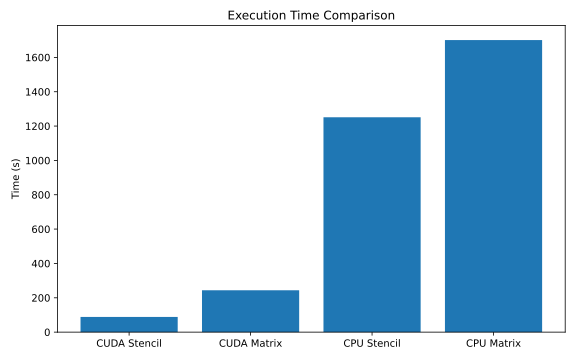
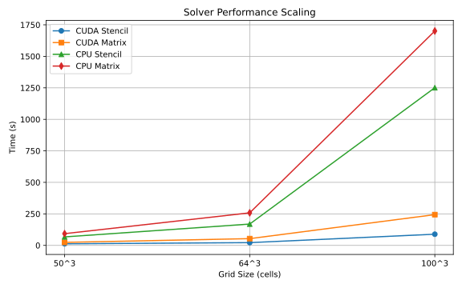

# Summary

**HeatTransfer3D** is a lightweight, high-performance C++ solver for 3D heat conduction problems. It imports arbitrary 3D domains from STL files (with patch assignment: inlet, outlet, and  wall) and supports mixed Dirichlet and Neumann boundary conditions. 

The software provides **four interchangeable solver backends** — CPU and CUDA implementations of both stencil-based and matrix-based Jacobi iterative solvers — allowing users to select the best combination of speed, memory usage, and hardware availability. Results are exported in VTK format for easy visualization in ParaView.

The software targets researchers and engineers working in thermal management, energy systems, materials processing, electronics cooling, and related fields.

# Statement of Need

Accurate modeling of three-dimensional heat conduction in complex geometries is essential across numerous scientific and engineering domains, including electronics cooling, battery thermal management, additive manufacturing, heat exchanger design, and materials processing. However, researchers and engineers often face a significant gap between overly simplistic tools and overly complex general-purpose simulation suites.

Commercial software such as ANSYS and COMSOL Multiphysics provide powerful capabilities but come with high licensing costs and steep learning curves, limiting accessibility for many academic and small-scale research groups. On the open-source side, general-purpose CFD frameworks like OpenFOAM [@weller2007openfoam; @jasak2007openfoam] and FEniCS [@logg2012automated] are highly capable but tend to be heavyweight for pure conduction problems. They require extensive setup for meshing, case configuration, and solver tuning, even when fluid flow and convection are not needed. Many existing open-source finite-difference heat solvers are limited to simple Cartesian or regular domains, lack native support for complex STL-based geometries, or do not offer flexible GPU acceleration options [@miotti2021meshless; @zhang2015gpu].

Specialized open-source tools for heat conduction are relatively scarce. While some GPU-accelerated finite-difference implementations exist, they are often proof-of-concept codes without robust geometry import, mixed boundary condition support, or multiple solver backends [@wei2014fast; @richter2013gpu]. Meshless approaches such as RBF-FD have shown promise for arbitrary geometries defined by STL files but typically require more complex setup and lack the performance-oriented multi-backend design needed for rapid parametric studies [@miotti2021meshless].

**HeatTransfer3D** addresses these limitations by providing a **lightweight, focused, and high-performance open-source solver** dedicated exclusively to steady-state and transient 3D heat conduction. Key innovations include:
- Direct import of complex geometries from STL files with automatic boundary patch detection,
- Support for mixed Dirichlet and Neumann boundary conditions,
- Four interchangeable solver backends (CPU/GPU stencil-based and matrix-based Jacobi solvers) that let users balance memory usage, stability, and speed on different hardware,
- Simple command-line interface and VTK output for seamless integration with ParaView.

By combining these features in a single, easy-to-compile C++ package with CMake, the software lowers the barrier for researchers who need fast, reproducible conduction simulations without the overhead of full multiphysics frameworks. This makes it particularly valuable for parametric studies, teaching, and early-stage thermal design in both academia and industry.

# Software Design

The codebase follows a clean, modular structure written in modern C++17 with optional CUDA support. The main directories are organized as follows:

- **`src/`**: Core implementation files, including the main driver, geometry processing, boundary condition handling, solver kernels, and VTK output routines.
- **`include/`**: Header files defining classes and functions for the grid, solvers, STL importer, and utilities.
- **`tests/`**: Unit and integration tests.
- **`stlFiles/`**: Sample geometries (cube, cylinder, L_Channel, semiCylinder) with associated boundary patch files.

The solver uses a uniform Cartesian grid with finite-difference discretization of the heat equation. Two fundamental algorithmic approaches are implemented:

1. **Stencil-based solvers** — Direct Jacobi iterations on the temperature field (low memory footprint, high performance).
2. **Matrix-based solvers** — Explicit assembly of a sparse coefficient matrix followed by Jacobi iterations (more flexible for extensions).

Each approach has both a CPU and CUDA (GPU) implementation. Users can select any of the four backends at runtime using a simple command-line flag (`--solver 1..4`). CUDA kernels are optimized for coalesced memory access and make use of shared memory where beneficial. The geometry pipeline automatically detects and labels boundary patches from separate STL files, simplifying the application of different boundary conditions.

CMake is used for building, with convenient `build.sh` and `installDeps` scripts provided.

# Performance

One of the key strengths of **HeatTransfer3D** is its **multi-backend design**, which allows users to dynamically select the most suitable solver based on the available hardware and problem size.

Performance comparisons for a representative test case (cube geometry with steady-state convergence) are shown below:

  
**Figure 1:** Execution time comparison of the four solvers for a 100 × 100 × 100 grid (lower is better). CUDA backends demonstrate substantial speedups over CPU implementations.

  
**Figure 2:** Strong scaling with increasing grid resolution (50³ to 150³). The GPU stencil backend maintains strong performance due to its low memory overhead.

All tests were conducted on the following hardware: CPU — 11th Gen Intel® Core™ i5-11400H @ 2.70 GHz; GPU — NVIDIA GeForce RTX 3050. The CUDA stencil solver achieves an **8–20× speedup** compared to the CPU stencil solver for grid sizes larger than 80³, while still providing reliable performance on CPU backends. This flexibility makes the software suitable for both rapid prototyping and large-scale simulations.

# Simulations
Here the few shapes simulated by solver will be displayed

# State of the Field

Several open-source heat transfer codes exist, but most are either limited to simple domains, lack GPU acceleration, or are part of much larger CFD frameworks. **3DHeatTransfer** stands out by combining automatic STL support, mixed boundary conditions, and four optimized solver backends in a single lightweight and easy-to-use package.

# Research Impact Statement

By offering high performance together with flexible solver selection, **3DHeatTransfer** enables faster design iterations and parametric studies in thermal engineering research. The open-source MIT license and modular structure also facilitate community contributions and integration into larger multiphysics workflows.

# AI Usage Disclosure

No AI tools were used in the development or writing of this software/paper beyond standard grammar and spell-checking assistance.

# Acknowledgements

We thank the open-source community for the tools that made this project possible.

# References
